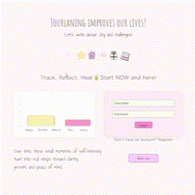
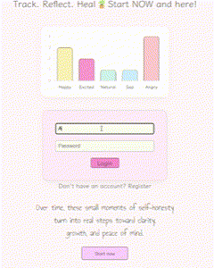
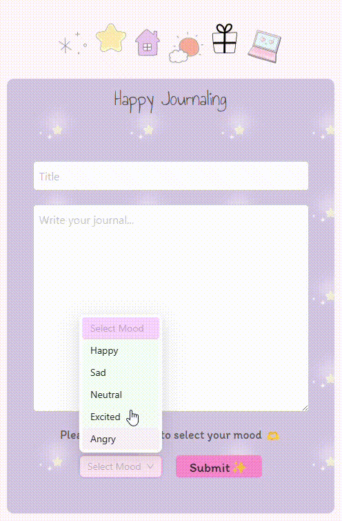
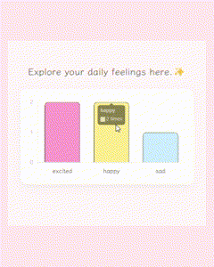

# Personal Journal App < ♥/>

My project is a cozy React journaling web application using Ant Design for UI 🌸.  
Users can register, log in, and start writing down their thoughts with a mood attached 💭💗.

## visual overview 🍓  

## languages 💻  

HTML, CSS, JavaScript

## Libraries & Tools ⭐ 

Reactjs, Ant Design (antd), Redux Toolkit, Axios, Passport.js, Node.js, Express, PostgreSQL

## Features 🌟  

1. Register & log in 🗝️
2. Create new journal entries 💌 
3. Each entry includes a mood selection 💖
4. Edit or delete past entries 🤍
5. Browse previous entries easily 💕
6. Mood Statistics section 📊

## Visual Example for log in/out 🌟

## Visual Example for mood selection 🌟

## Visual Example for Mood Stats 🌟  

## Managing state 💫  

Handled with Redux Toolkit & custom hooks like `useAuth` and `useContent` 🌻

## Last note 🌼  

**This is one of my very first full-stack personal apps 🍒🚀**

### Thanks for reading ♡ ⋆｡˚
